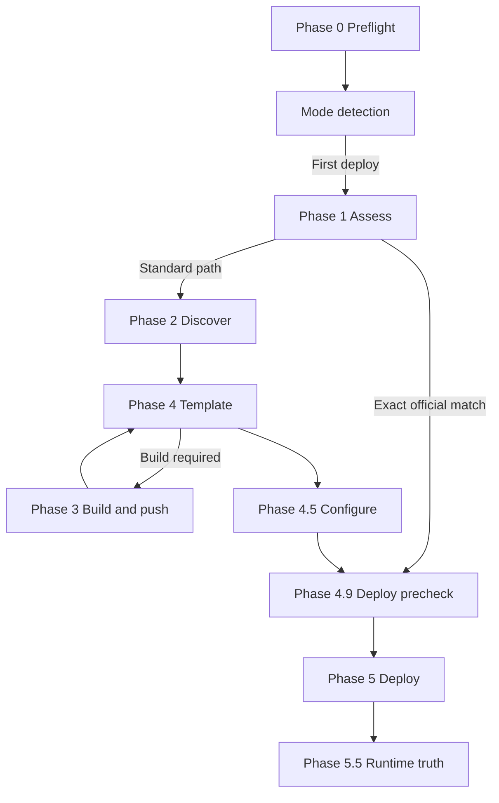

Sealos Deploy is the entry point and orchestrator for full project deployments. It accepts a GitHub repository, a local project directory, or the current working directory. It judges whether the project can run on Sealos, reuses a matching [official template catalog](https://github.com/labring-actions/templates/tree/kb-0.9/template) entry when possible, otherwise prepares container images and a Sealos deployment template. It then deploys, verifies runtime behavior, and recognizes existing apps on later runs.

This specification describes **what Sealos Deploy does**. It does not document internal scripts, implementation details, or other skills.

<Note>
This section is the **single source of truth** for the `sealos-deploy` lifecycle. Compare implementation on the [`sealos-skills` `codex/review-sealos-deploy` branch](https://github.com/labring/sealos-skills/tree/codex/review-sealos-deploy). The legacy wiki is historical reference only.
</Note>

## Named phases

Sealos Deploy defines **12 named phases**:

| Category | Phases |
| --- | --- |
| Main deploy lifecycle | Phase 0, 1, 2, 3, 4, 4.5, 4.9, 5, 5.5 |
| Existing-app update | Phase U1, U2, U3 |
| Unnumbered lifecycle | Mode detection, interrupt recovery, state recording, cleanup |

Phase 0 and [mode detection](/en/pipeline/mode-detection) are the shared entry for every run. Phase 1 runs only in DEPLOY mode.

## First-deploy routes

**Official template path:** preflight → mode detection → assess (fast path) → **Phase 4.9 deploy precheck** → Phase 5 collects template inputs → deploy → runtime truth → state recording

**Standard build path:** preflight → mode detection → assess → no fast path → **Phase 2** (`deployment-plan.json`) → **Phase 4** (Phase 3 build when needed) → template generation → configure → **Phase 4.9 deploy precheck (YAML dry-run)** → deploy → runtime truth → state recording

One Sealos deploy maps to one full-repo template. Multi-service Compose projects must preserve full service topology.

Phase 4.9 runs before Phase 5. The agent must dry-run the final YAML. Deploy proceeds only after dry-run passes.

## Update route

When an existing deployment is recognized:

preflight → recognize existing app → rebuild one or more services, or restart one or more exact workloads → apply update → verify rollout → record success or roll back

See [Update mode](/en/pipeline/update-mode) and [Phase U1–U3](/en/pipeline/update/phase-u1-prepare).

## Phase index

| Phase | Name | Primary task |
| --- | --- | --- |
| [Phase 0](/en/pipeline/phases/phase-0-preflight) | Preflight | Environment, source materialization, gitingest/railpack deps |
| [Phase 1](/en/pipeline/phases/phase-1-assess) | Assess | Judge deployability, choose path |
| [Phase 2](/en/pipeline/phases/phase-2-discover) | Discover | gitingest scout, subagent produces `deployment-plan.json` |
| [Phase 3](/en/pipeline/phases/phase-3-build-push) | Build and push | `linux/amd64` images to GHCR |
| [Phase 4](/en/pipeline/phases/phase-4-template) | Template | Generate canonical Sealos template |
| [Phase 4.5](/en/pipeline/phases/phase-4-5-configure) | Configure | Collect inputs and confirm deploy |
| Phase 4.9 | Deploy precheck | Dry-run final YAML before Phase 5 |
| [Phase 5](/en/pipeline/phases/phase-5-deploy) | Deploy | Create cloud resources |
| [Phase 5.5](/en/pipeline/phases/phase-5-5-runtime-truth) | Runtime truth | Verify live behavior before success |
| [Phase U1](/en/pipeline/update/phase-u1-prepare) | Prepare update | Select services to rebuild or workloads to restart |
| [Phase U2](/en/pipeline/update/phase-u2-apply) | Apply update | Replace images or trigger restarts |
| [Phase U3](/en/pipeline/update/phase-u3-verify-rollback) | Verify and rollback | Confirm rollout or restore previous digests |

## Related pages

- [Mode detection](/en/pipeline/mode-detection)
- [Artifacts](/en/pipeline/artifacts)
- [State and completion](/en/pipeline/state-and-completion)
- [Cleanup boundaries](/en/pipeline/cleanup)
