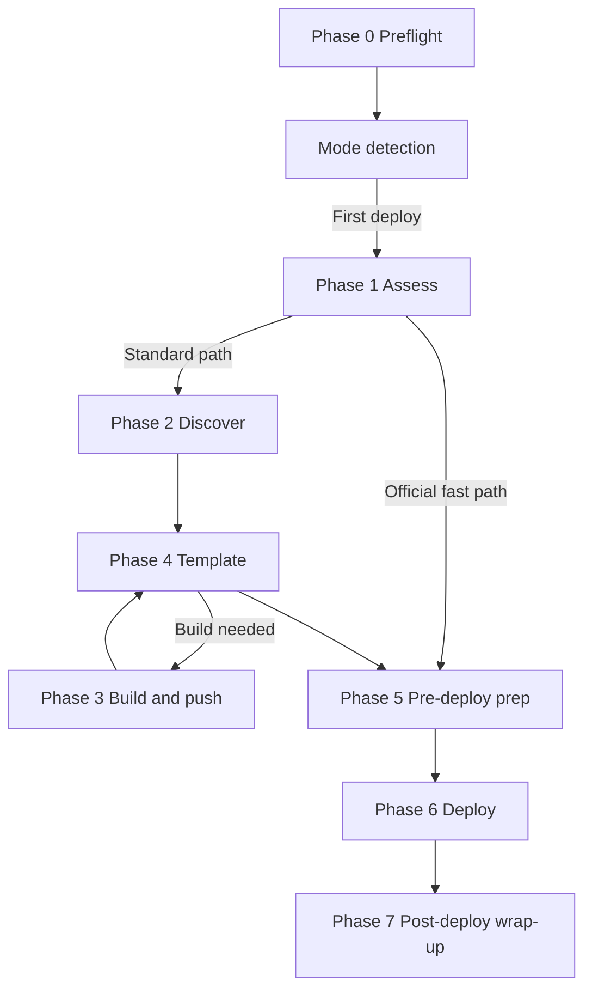

Sealos Deploy is the entry point and orchestrator for full project deployments. It accepts a GitHub repository, a local project directory, or the current working directory. It judges whether the project can run on Sealos, reuses a matching [official template catalog](https://github.com/labring-actions/templates/tree/kb-0.9/template) entry when possible, otherwise prepares container images and a Sealos deployment template. It then deploys, verifies runtime behavior, and recognizes existing apps on later runs.

This page describes **what** Sealos Deploy does, not internal scripts, implementation details, or other skill internals.

<Note>
This chapter is the **SSOT** for the `sealos-deploy` lifecycle. Implementation reference: [`codex/review-sealos-deploy` on `sealos-skills`](https://github.com/labring/sealos-skills/tree/codex/review-sealos-deploy). Legacy Wiki is historical only.
</Note>

## Named phases

Sealos Deploy defines **11 named phases**:

| Category | Phases |
| --- | --- |
| Main deploy lifecycle | Phase 0, 1, 2, 3, 4, 5, 6, 7 |
| Existing app updates | Phase U1, U2, U3 |
| Unnumbered steps | Mode detection, interrupt recovery, cleanup |

Phase 0 and [mode detection](/en/pipeline/mode-detection) are the common entry for every run. Phase 1 runs only in DEPLOY mode.

## First-deploy routes

**Official template path:** preflight → mode detection → assess (exact match and fetch official template) → **Phase 5 pre-deploy preparation** → Phase 6 deploy → Phase 7 post-deploy wrap-up

**Standard build path:** preflight → mode detection → assess → no fast path → **Phase 2** (`deployment-plan.json`) → **Phase 4** (Phase 3 build when needed) → template generation → **Phase 5 pre-deploy preparation** → Phase 6 deploy → Phase 7 post-deploy wrap-up

One Sealos deploy maps to one full-repo template; multi-service Compose and similar projects must keep the full service topology.

Phase 5 runs before Phase 6. The agent must collect inputs when needed, record user confirmation, and dry-run the final YAML. Deploy proceeds only after precheck passes.

## Update route

After recognizing an existing app: preflight → choose rebuild or restart → apply update → verify rollout → record success or rollback

See [Update mode](/en/pipeline/update-mode) and [Phases U1–U3](/en/pipeline/update/phase-u1-prepare).

## Phase index

| Phase | Name | Main task |
| --- | --- | --- |
| [Phase 0](/en/pipeline/phases/phase-0-preflight) | Preflight | Environment, source materialization, gitingest/railpack deps |
| [Phase 1](/en/pipeline/phases/phase-1-assess) | Assess | Judge deployability, choose path |
| [Phase 2](/en/pipeline/phases/phase-2-discover) | Discover | gitingest, `deployment-plan.json` |
| [Phase 3](/en/pipeline/phases/phase-3-build-push) | Build and push | Push `linux/amd64` images to GHCR |
| [Phase 4](/en/pipeline/phases/phase-4-template) | Template | Generate canonical Sealos template |
| [Phase 5](/en/pipeline/phases/phase-5-prepare) | Pre-deploy preparation | Collect inputs, confirm, YAML dry-run |
| [Phase 6](/en/pipeline/phases/phase-6-deploy) | Deploy | Create cloud resources |
| [Phase 7](/en/pipeline/phases/phase-7-post-deploy) | Post-deploy wrap-up | Runtime verification and state recording |
| [Phase U1](/en/pipeline/update/phase-u1-prepare) | Prepare update | Choose rebuild targets or restart workloads |
| [Phase U2](/en/pipeline/update/phase-u2-apply) | Apply update | Replace images or trigger restart |
| [Phase U3](/en/pipeline/update/phase-u3-verify-rollback) | Verify and rollback | Confirm rollout or restore digests |

## Related pages

- [Mode detection](/en/pipeline/mode-detection)
- [Artifacts](/en/pipeline/artifacts)
- [State and completion](/en/pipeline/state-and-completion)
- [Cleanup](/en/pipeline/cleanup)
