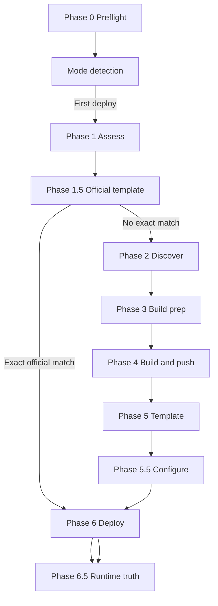

Sealos Deploy is the entry point and orchestrator for full project deployments. It accepts a GitHub repository, a local project directory, or the current working directory. It judges whether the project can run on Sealos, reuses a matching official template when possible, otherwise prepares container images and a Sealos deployment template. It then deploys, verifies runtime behavior, and recognizes existing apps on later runs.

This specification describes **what Sealos Deploy does**. It does not document internal scripts, implementation details, or other skills.

<Note>
This section is the **single source of truth** for the `sealos-deploy` lifecycle. It replaces the [Sealos Deploy Lifecycle wiki](https://github.com/labring/sealos-skills/wiki/Sealos-Deploy-Lifecycle) as the authoritative reference.
</Note>

## Named phases

Sealos Deploy defines **13 named phases**:

| Category | Phases |
| --- | --- |
| Main deploy lifecycle | Phase 0, 1, 1.5, 2, 3, 4, 5, 5.5, 6, 6.5 |
| Existing-app update | Phase U1, U2, U3 |
| Unnumbered lifecycle | Mode detection, interrupt recovery, state recording, cleanup |

Phase 0 and mode detection are the shared entry for every run. Phase 1 runs only on the first-deploy path.

## First-deploy routes

**Official template path:** preflight → mode detection → assess → unique exact catalog match → reuse official template as-is → collect template inputs → deploy → runtime truth → state recording

**Standard build path:** preflight → mode detection → assess → no reusable official template → image and topology discovery → per-service image reuse or build → Sealos template generation → app configuration → deploy → runtime truth → state recording

## Update route

When an existing deployment is recognized:

preflight → recognize existing app → rebuild one or more services, or restart one or more exact workloads → apply update → verify rollout → record success or roll back

See [Update mode](/en/pipeline/update-mode) and [Phase U1–U3](/en/pipeline/update/phase-u1-prepare).

## Phase index

| Phase | Name | Primary task |
| --- | --- | --- |
| [Phase 0](/en/pipeline/phases/phase-0-preflight) | Preflight | Environment, region, auth, workspace, and source materialization |
| [Phase 1](/en/pipeline/phases/phase-1-assess) | Assess | Deployment shape, cloud-native readiness, project facts |
| [Phase 1.5](/en/pipeline/phases/phase-1-5-template) | Official template | Exact catalog match → skip to Phase 6, else continue to Phase 2 |
| [Phase 2](/en/pipeline/phases/phase-2-discover) | Discover | Image inventory, service topology, digest pinning |
| [Phase 3](/en/pipeline/phases/phase-3-build-prep) | Build prep | Per-service Dockerfile and build definition |
| [Phase 4](/en/pipeline/phases/phase-4-build-push) | Build and push | `linux/amd64` images to GHCR with digest |
| [Phase 5](/en/pipeline/phases/phase-5-template) | Template | Generate canonical Sealos template |
| [Phase 5.5](/en/pipeline/phases/phase-5-5-configure) | Configure | Collect inputs and confirm deploy |
| [Phase 6](/en/pipeline/phases/phase-6-deploy) | Deploy | Create cloud resources |
| [Phase 6.5](/en/pipeline/phases/phase-6-5-runtime-truth) | Runtime truth | Verify live behavior before success |
| [Phase U1](/en/pipeline/update/phase-u1-prepare) | Prepare update | Select services to rebuild or workloads to restart |
| [Phase U2](/en/pipeline/update/phase-u2-apply) | Apply update | Replace images or trigger restarts |
| [Phase U3](/en/pipeline/update/phase-u3-verify-rollback) | Verify and rollback | Confirm rollout or restore previous digests |

## Related pages

- [Run entry](/en/pipeline/entry) — project sources and logging
- [Mode detection](/en/pipeline/mode-detection) — DEPLOY vs UPDATE, interrupt recovery, GitHub bridge state
- [Artifacts](/en/pipeline/artifacts) — `.sealos/` file layout
- [State and completion](/en/pipeline/state-and-completion) — success criteria and `state.json`
- [Cleanup boundaries](/en/pipeline/cleanup) — temp directories and deletion rules
