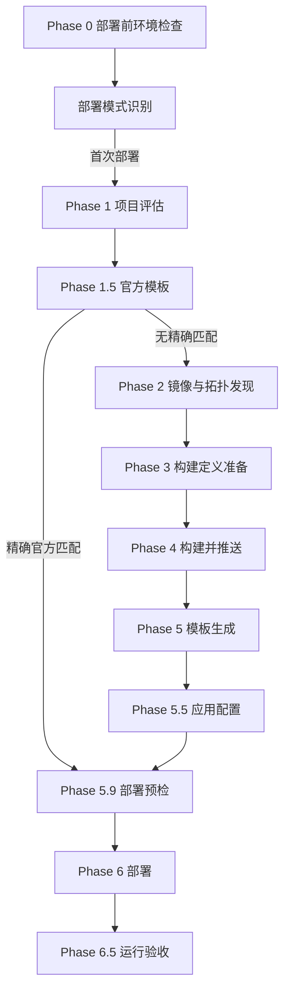

Sealos Deploy 是完整项目部署请求的入口和编排器。它接收 GitHub 仓库、本地项目目录或当前项目，判断项目是否适合部署，优先复用匹配的 Sealos 官方模板；没有可直接复用的模板时，再准备容器镜像和新的 Sealos 部署模板。随后完成部署与运行验收，并在后续运行中识别已有应用。

本文只描述 Sealos Deploy **做什么**，不展开内部脚本、实现细节或其他 Skill 的内部流程。

<Note>
本章节是 `sealos-deploy` 生命周期的**规范源（SSOT）**。对照实现见 [`sealos-skills` 的 `codex/review-sealos-deploy` 分支](https://github.com/labring/sealos-skills/tree/codex/review-sealos-deploy)。旧 Wiki 仅作历史参考。
</Note>

## 具名阶段

Sealos Deploy 一共定义 **14 个具名 Phase**：

| 类别 | 阶段 |
| --- | --- |
| 主部署生命周期 | Phase 0、1、1.5、2、3、4、5、5.5、5.9、6、6.5 |
| 已有应用更新 | Phase U1、U2、U3 |
| 未编号环节 | 部署模式识别、中断恢复、状态记录、清理 |

Phase 0 和部署模式识别是每次运行的共同入口；Phase 1 只在首次部署流程中执行。

## 首次部署路径

**官方模板路径：** 部署前环境检查 → 部署模式识别 → 项目评估 → 唯一精确匹配 → 原样复用官方模板 → 收集模板输入 → **Phase 5.9 部署预检（YAML dry-run）** → 部署 → 运行验收 → 状态记录

**标准构建路径：** 部署前环境检查 → 部署模式识别 → 项目评估 → 无可用官方模板 → 镜像与拓扑发现 → 逐服务构建或复用镜像 → 模板生成 → 应用配置 → **Phase 5.9 部署预检（YAML dry-run）** → 部署 → 运行验收 → 状态记录

Phase 5.9 在 Phase 6 之前执行。Agent 必须对最终 YAML 运行 dry-run。只有 dry-run 通过，才能进入部署阶段。

## 更新路径

识别已有应用后：部署前环境检查 → 选择重建或重启 → 应用更新 → 验证发布 → 记录成功或回滚

见 [更新模式](/pipeline/update-mode) 与 [Phase U1–U3](/pipeline/update/phase-u1-prepare)。

## 阶段索引

| Phase | 名称 | 主要任务 |
| --- | --- | --- |
| [Phase 0](/pipeline/phases/phase-0-preflight) | 部署前环境检查 | 环境、区域、登录、工作空间、源码物化 |
| [Phase 1](/pipeline/phases/phase-1-assess) | 项目评估 | 部署形态、云原生就绪度、项目事实 |
| [Phase 1.5](/pipeline/phases/phase-1-5-template) | 官方模板复用 | 精确匹配则进入 Phase 5.9，否则进入 Phase 2 |
| [Phase 2](/pipeline/phases/phase-2-discover) | 镜像与拓扑发现 | 镜像清单、服务拓扑、digest 固定 |
| [Phase 3](/pipeline/phases/phase-3-build-prep) | 构建定义准备 | 逐服务 Dockerfile 与构建定义 |
| [Phase 4](/pipeline/phases/phase-4-build-push) | 构建并推送 | `linux/amd64` 镜像推送到 GHCR |
| [Phase 5](/pipeline/phases/phase-5-template) | 模板生成 | 生成 canonical Sealos 模板 |
| [Phase 5.5](/pipeline/phases/phase-5-5-configure) | 交互式配置 | 收集输入并确认部署 |
| Phase 5.9 | 部署预检 | 对最终 YAML 执行 dry-run，通过后进入 Phase 6 |
| [Phase 6](/pipeline/phases/phase-6-deploy) | 部署 | 创建云端资源 |
| [Phase 6.5](/pipeline/phases/phase-6-5-runtime-truth) | 运行事实验收 | 验证真实运行状态 |
| [Phase U1](/pipeline/update/phase-u1-prepare) | 准备更新 | 选择重建服务或重启工作负载 |
| [Phase U2](/pipeline/update/phase-u2-apply) | 应用更新 | 替换镜像或触发重启 |
| [Phase U3](/pipeline/update/phase-u3-verify-rollback) | 验证与回滚 | 确认发布或恢复 digest |

## 相关页面

- [运行入口](/pipeline/entry)
- [部署模式识别](/pipeline/mode-detection)
- [产物](/pipeline/artifacts)
- [状态与完成](/pipeline/state-and-completion)
- [清理边界](/pipeline/cleanup)
